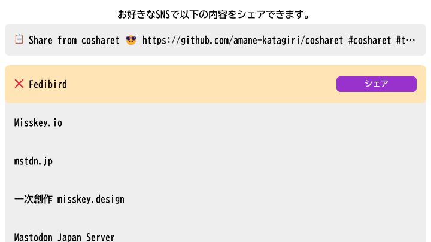

# cosharet: COSmo SHARE Tool



## Overview

This is a tiny hub for sharing posts in the Fediverse (currently Masotodon and Misskey).

## Usage

### Use share link

1. Open the [link](https://cosharet.pages.dev/#text=Share%20from%20cosharet%20%F0%9F%98%8E&url=https://github.com/amane-katagiri/cosharet&hashtags=cosharet,test) on your favorite site.
1. Select or add a fediverse instance you want to share from.
1. Click share button to open share page on your instance.

### Create share link

Install link [https://cosharet.pages.dev/#text=text you want to share 😎&url=https://example.com/&hashtags=hashtag,with,comma,separation](https://cosharet.pages.dev/#text=text%20you%20want%20to%20share%20%F0%9F%98%8E&url=https%3A%2F%2Fexample.com%2F&hashtags=hashtag,with,comma,separation) to your site.

- `text`: Text you want to share 😎 (must be encoded: `text%20you%20want%20tp%20share%20%F0%9F%98%8E`)
- `url`: Url you want to share with (must be encoded: `https%3A%2F%2Fexample.com%2F`)
- `hashtags`: Hashtags you want share (must be split with comma: `hashtag,with,comma,separation`)
- `theme`: Name of page theme (with light/dark mode)
  - `bluebird`
  - `greenballoon`
  - `redtriangle`
  - `rainbowflag`

You can modify `theme` colors, in hex style (`#RGB`, `#RGBA`, `#RRGGBB`, `#RRGGBBAA`), some color/image functions (`rgb(...)`, `hsl(...)`, `linear-gradient(...)`, ...) or color name (`aliceblue` ...).

#### light theme

- `gflc`: foreground color (for text)
- `gblc`: background color
- `cblc`: component background color
- `sblc`: selected instance background color
- `galc`: accent color (for link text and share button)

#### dark theme

- `gfdc`: foreground color (for text)
- `gbdc`: background color
- `cbdc`: component background color
- `sbdc`: selected instance background color
- `gadc`: accent color (for link text and share button)

You can also pass parameters via query(`?...`).

### Run cosharet on local

```sh
pnpm i
pnpm run dev
# Open http://localhost:5173/
```

### Build cosharet

```sh
pnpm i
pnpm run build
# Upload or serve ./dist/
```

## Feature

- Share links in the Fediverse and non-fediverse services.
- Preview text to share before posting.
- Save your instance list on your compuer.
- Show frequently used instances on top.
- Set the color theme from the link parameter.
- One click mode: share via the most frequently used instance.

## Reference

- [donshare](https://donshare.net/)
- [Misskey Share](https://misskeyshare.link/)

## Author

- [Amane Katagiri](https://fedibird.com/@amane)

## License

MIT License
